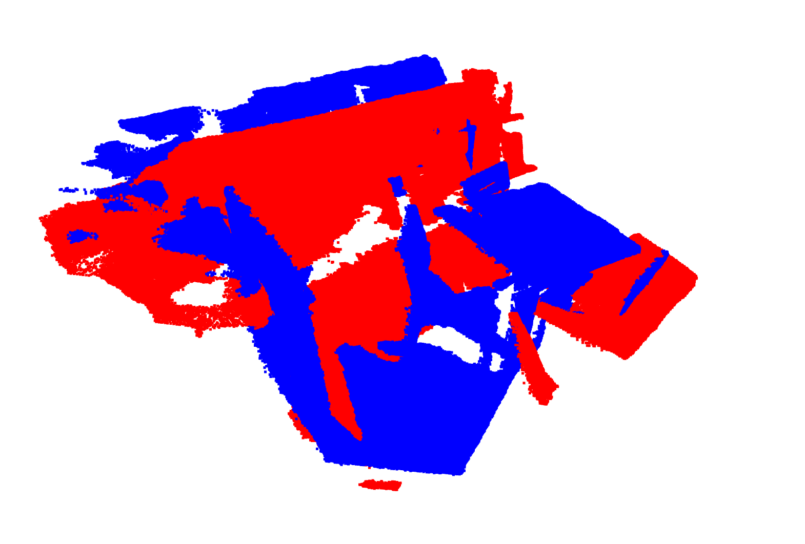
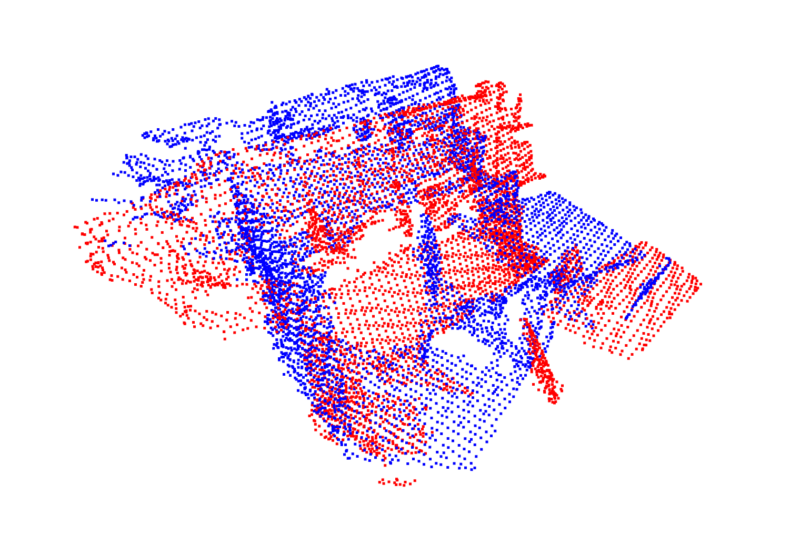
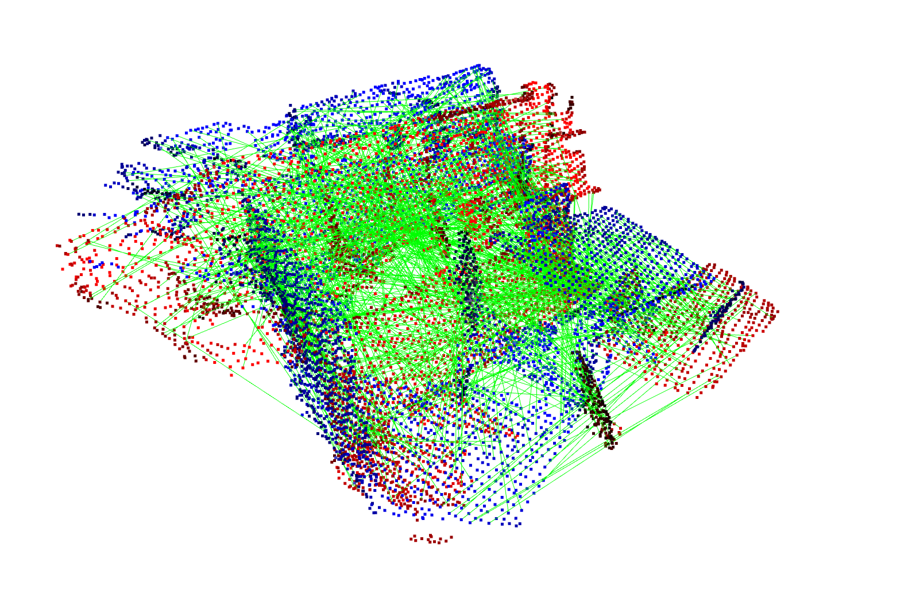
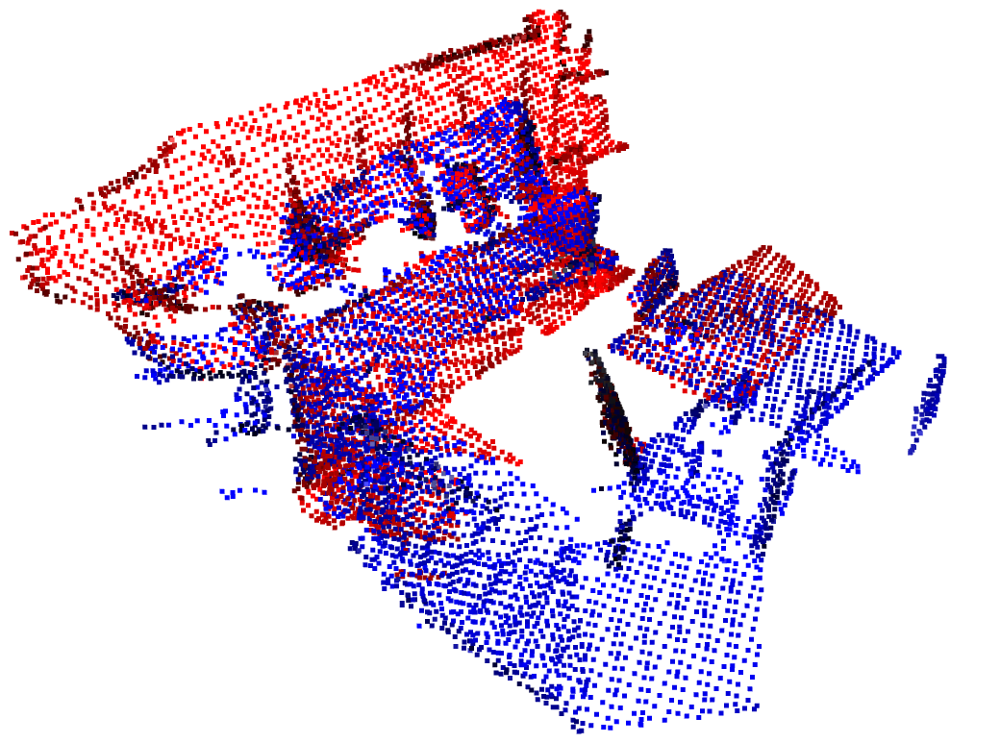
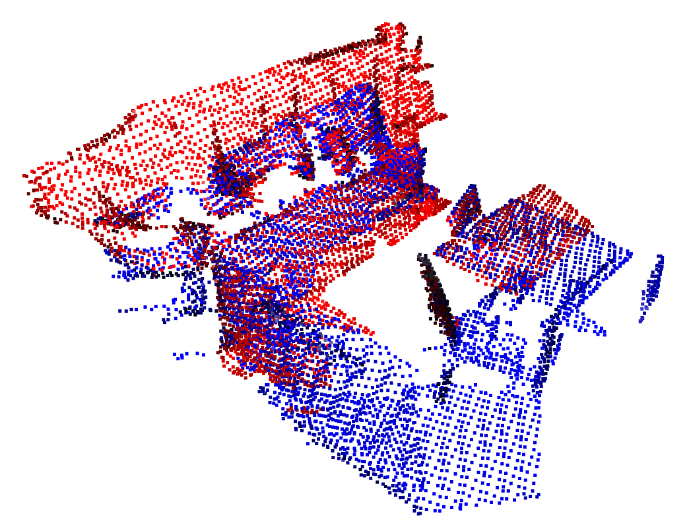

## Tutorial: Registration on 3DMatch with FPFH + TEASER + ICP

### Prerequisites
- [Install Conda](https://docs.conda.io/projects/conda/en/latest/user-guide/install/#regular-installation)
- Create a conda environment called `py3-teaser`:
```shell
conda create -n py3-teaser python=3.6
```
- Activate `py3-teaser` and install packages:
```shell
conda activate py3-teaser
conda install scipy
pip install open3d
```
- Within `py3-teaser` environment, [build and install TEASER++'s python bindings](https://github.com/MIT-SPARK/TEASER-plusplus#minimal-python-3-example) (no need to download TEASER repo inside this folder):
```shell
git clone https://github.com/MIT-SPARK/TEASER-plusplus.git
cd TEASER-plusplus && mkdir build && cd build
cmake -DTEASERPP_PYTHON_VERSION=3.6 .. && make teaserpp_python
cd python && pip install .
```

### Registration Tutorial
1. Load and visualize a pair of point clouds



2. Voxel downsampling



3. Extract FPFH feature descriptors


4. Establish putative correspondences



5. Robust global registration using TEASER++



6. Local refinement using ICP



### Acknowledgements


